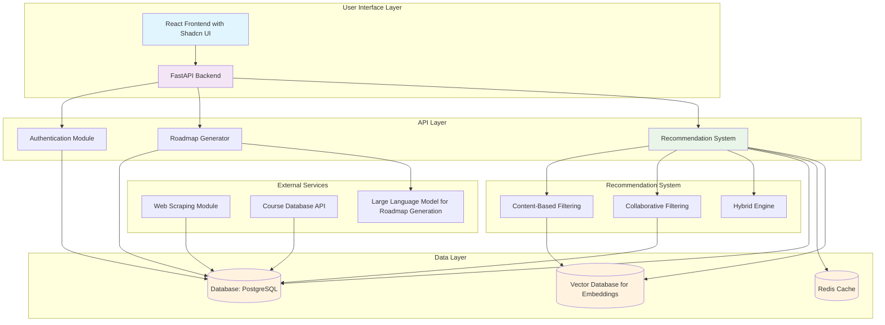

# System Architecture

## Component Descriptions

### User Interface Layer
- **React Frontend**: Built with Shadcn UI components for modern, responsive design
- Handles user input for concepts to learn and duration preferences
- Displays generated roadmaps and recommended resources

### API Layer
- **FastAPI Backend**: Provides RESTful APIs for all system operations
- **Authentication Module**: User management and session handling
- **Roadmap Generator**: Processes user input to create step-by-step learning paths
- **Recommendation System**: Core ML-based recommendation engine

### Recommendation System
- **Content-Based Filtering**: Recommends resources based on:
  - Difficulty level
  - Prerequisites
  - Learning style
  - Tags
  - Ratings
  - Media type
- **Collaborative Filtering**: Uses user ratings and completion status for similarity-based recommendations
- **Hybrid Engine**: Combines both approaches for optimal recommendations

### Data Layer
- **PostgreSQL**: Main database for user data, roadmaps, resources, and interactions
- **Redis Cache**: Caches frequently accessed recommendations and user sessions
- **Vector Database**: Stores embeddings for content-based similarity calculations

### External Services
- **Web Scraping Module**: Collects learning resources from various online platforms
- **Course Database API**: Integrates with external course databases (if available)
- **LLM**: Uses large language models to generate personalized roadmaps based on user input

## Data Flow

1. User inputs concept and duration through React frontend
2. Frontend sends request to FastAPI backend
3. Backend processes input and generates roadmap using LLM
4. Recommendation system analyzes user preferences and generates resource suggestions
5. Results are cached and returned to frontend for display
6. User interactions (ratings, completion status) are stored for future recommendations