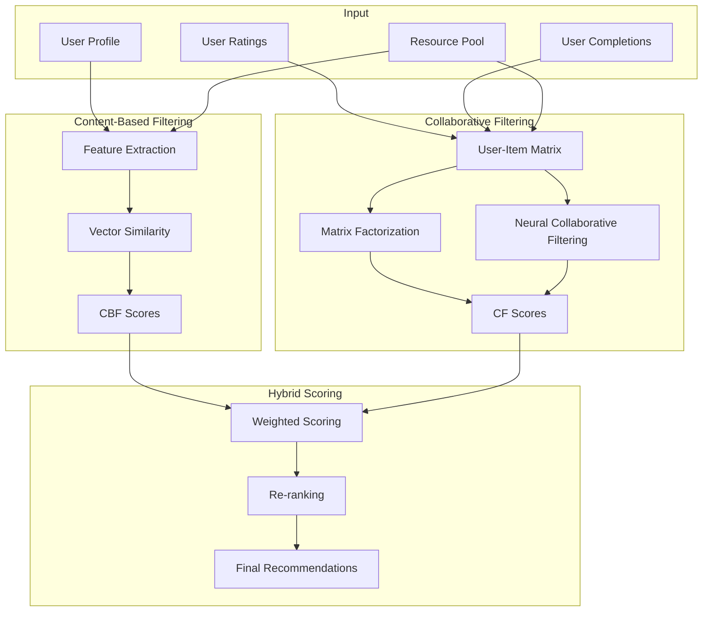

# Hybrid Recommendation Engine Design

## Overview

The recommendation system combines content-based filtering and collaborative filtering to provide personalized learning resource recommendations. This hybrid approach addresses the cold-start problem and leverages both user preferences and community behavior.

## Architecture



## Content-Based Filtering (CBF)

### Feature Engineering

#### Resource Features
- **Text Features**: TF-IDF vectors from title, description, tags
- **Categorical Features**: One-hot encoded difficulty, media_type, learning_style
- **Numerical Features**: duration_minutes, rating, rating_count
- **Array Features**: Tags and prerequisites as multi-hot encoded vectors

#### User Features
- **Preferences**: preferred_difficulty, preferred_learning_style, preferred_media_types
- **Profile**: experience_level, learning_style
- **Interaction History**: Aggregated features from past interactions

### Similarity Calculation

#### Cosine Similarity
```
similarity(u, i) = (user_vector · item_vector) / (||user_vector|| * ||item_vector||)
```

#### Feature Weights
- Title/Description: 0.4
- Tags: 0.3
- Difficulty/Media Type: 0.2
- Rating/Duration: 0.1

### CBF Algorithm

1. **User Profile Vector Creation**
   - Combine user preferences and interaction history
   - Weight recent interactions more heavily

2. **Resource Vectorization**
   - Transform all resources into feature vectors
   - Store in vector database for efficient similarity search

3. **Similarity Scoring**
   - Compute cosine similarity between user vector and all resource vectors
   - Rank resources by similarity score

## Collaborative Filtering (CF)

### User-Item Interaction Matrix

#### Matrix Construction
- Rows: Users
- Columns: Resources
- Values: Implicit feedback (views, ratings, completions) + explicit ratings

#### Implicit Feedback Encoding
- View: 0.1
- Save: 0.3
- Rate: rating_value * 0.5
- Complete: 1.0

### Matrix Factorization

#### SVD-based Approach
```
R ≈ P × Q^T
```
Where:
- R: User-item rating matrix
- P: User latent factors matrix
- Q: Item latent factors matrix

#### Training Process
1. Initialize P and Q randomly
2. Minimize loss: `L = ||R - P×Q^T||² + λ(||P||² + ||Q||²)`
3. Use gradient descent for optimization

### Neural Collaborative Filtering

#### Architecture
```
User ID -> Embedding -> Concat -> MLP -> Output
Item ID -> Embedding -> Concat -> MLP -> Output
```

#### Model Layers
1. **Embedding Layer**: Convert user/item IDs to dense vectors
2. **Concatenation**: Combine user and item embeddings
3. **Multi-Layer Perceptron**: Learn non-linear interactions
4. **Output Layer**: Predict rating/interaction probability

#### Training
- Loss: Binary cross-entropy for implicit feedback
- Optimizer: Adam with learning rate decay
- Regularization: Dropout and L2 regularization

### CF Algorithm

1. **Matrix Construction**
   - Build user-item interaction matrix
   - Handle sparsity with negative sampling

2. **Model Training**
   - Train MF and NCF models
   - Validate on held-out interactions

3. **Prediction**
   - Generate predictions for all user-item pairs
   - Rank unrated items by predicted score

## Hybrid Scoring

### Weighted Combination
```
hybrid_score = α × cbf_score + β × cf_score
```

#### Weight Determination
- **Cold Start Users**: α = 0.8, β = 0.2
- **Established Users**: α = 0.4, β = 0.6
- **Dynamic Adjustment**: Based on confidence scores from each method

### Confidence Scores

#### CBF Confidence
- Based on number of user interactions
- Higher confidence for users with rich preference data

#### CF Confidence
- Based on matrix density and model performance
- Higher confidence for popular items and active users

### Re-ranking Strategies

#### Diversity Promotion
- Penalize similar items in top recommendations
- Use MMR (Maximal Marginal Relevance)

#### Novelty Enhancement
- Boost less popular but highly relevant items
- Balance familiarity with discovery

#### Business Rules
- Prioritize high-quality, verified resources
- Respect user content preferences
- Avoid duplicate recommendations

## Implementation Details

### Data Preprocessing

#### Text Processing
- Lowercase, remove stopwords, lemmatization
- Create TF-IDF vectors
- Generate word embeddings (Word2Vec, BERT)

#### Feature Normalization
- Standardize numerical features
- Handle missing values with imputation

#### Categorical Encoding
- One-hot encoding for low-cardinality features
- Target encoding for high-cardinality features

### Model Training Pipeline

#### Offline Training
1. **Data Collection**: Gather user interactions and resource data
2. **Feature Engineering**: Create feature vectors
3. **Model Training**: Train CBF and CF models
4. **Model Evaluation**: A/B testing and offline metrics
5. **Model Deployment**: Update production models

#### Online Inference
1. **Real-time Scoring**: Compute hybrid scores for candidate items
2. **Filtering**: Apply business rules and user constraints
3. **Ranking**: Sort by hybrid score with diversity adjustments
4. **Caching**: Store results for similar requests

### Evaluation Metrics

#### Offline Metrics
- **Precision@K**: Fraction of recommended items that are relevant
- **Recall@K**: Fraction of relevant items that are recommended
- **NDCG@K**: Normalized discounted cumulative gain
- **Coverage**: Percentage of items that can be recommended

#### Online Metrics
- **CTR (Click-Through Rate)**: Clicks on recommended items
- **Conversion Rate**: Resources that users complete
- **User Engagement**: Time spent, return visits
- **A/B Test Results**: Compare recommendation quality

### Cold Start Handling

#### New Users
- Use demographic data for initial recommendations
- Leverage content-based filtering with default preferences
- Gradually incorporate collaborative signals as data accumulates

#### New Resources
- Content-based similarity to existing resources
- Boost visibility through popularity-based ranking
- Use metadata for initial categorization

### Scalability Considerations

#### Computational Complexity
- CBF: O(n×d) for n resources, d features
- CF: O(u×i×f) for u users, i items, f factors
- Hybrid: Linear combination of both

#### Optimization Techniques
- Approximate nearest neighbors for CBF
- Dimensionality reduction (PCA, t-SNE)
- Model compression and quantization
- Distributed training for large datasets

#### Real-time Requirements
- Pre-compute user vectors
- Cache frequent queries
- Use approximate methods for speed-accuracy trade-off